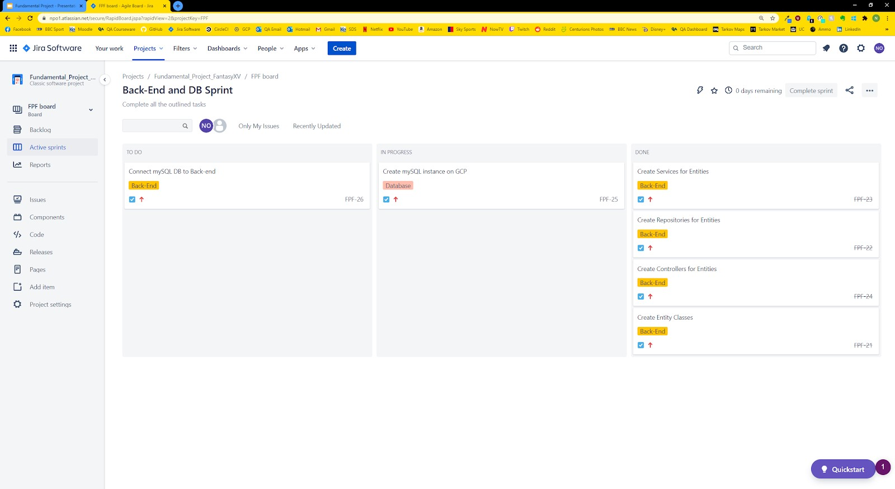
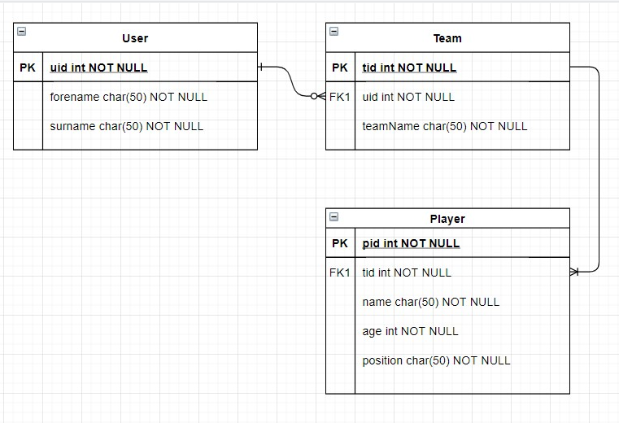
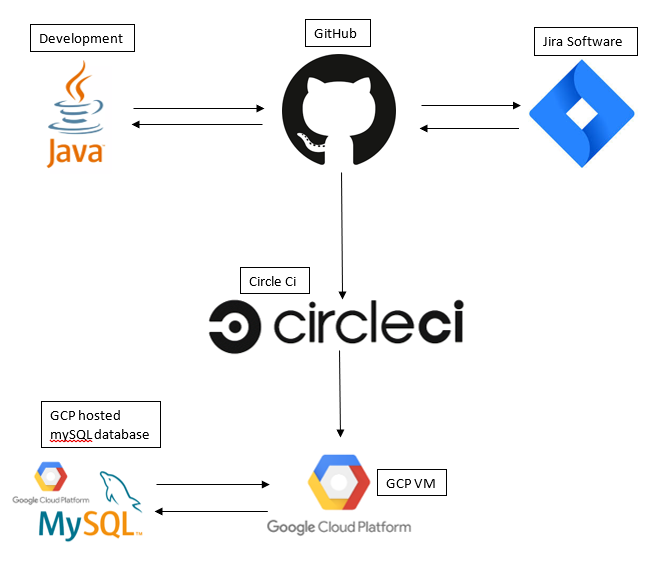

# **Fantasy V README**

My project is going to be a Fantasy V Rugby Union team selector. Users will be able to create 
their own custom teams, after which they can save for later retrieval. 

## Requirements for the App:
The project specification required me to create a CRUD web application, where CRUD stands for:
* **C**reate - The user must be able to create something which can be stored.
* **R**ead - The user must be able to view something they have previously created.
* **U**pdate - The user must be able to edit and store changes to their created work.
* **D**elete - The user must be able to delete what they have created.

## App Architecture

### Planning phase

#### Risk Assessment
Risks are a major part of every project and something that 
needs to be addressed. Each project has its own potential risks,
and mine is no exception. Because of this, I have analysed risks
which cover the whole scope of the project as to ensure that
each area has precautions in place to ensure that the risks are
mitigated, not only in specific areas but as a whole for the project.

Within my risk assessment I will be using different levels to classify the risks
in given areas, these are as follows:
* Likelihood
    * High - This means that chance of this risk occurring is very likely and
    that there are not any or very little mitigating factors in place to prevent
    this risk from occurring.
    * Medium - This means that there is a chance of the risk occurring but there
    are mitigating factors in place to prevent this.
    * Low - This means that there is little chance of the risk occurring.
* Impact
    * High - The risk can cause a severe or catastrophic failure of the site
    resulting in no access or a malfunction.
    * Medium - The risk can cause a malfunction on the site but won't result
    in any major impacts such as loss of data.
    * Low - The risk can't cause any major impact because measures are in
    place to recover from this risk.
* Tolerance
    * Tolerate - No action taken because the preventative measures in place
    are sufficient to manage the consequences of the risk.
    * Handle - Action taken to mitigate the consequences of the risk.
    
| Risk | Description | Likelihood | Impact | Responsibility | Current Mitigation | Intended Mitigation | Response | Tolerate? |
| :---: | :---: | :---: | :---: | :---: | :---: | :---: | :---: | :---: |
| Unable to access SQL Database | For any array of reasons (no internet connection for example), accessing GCP to access the mySQL database could fail and not be possible and this would result in the web application being in an unusable state. | Low | Medium | GCP | None | Setup multiple local and external backups of the Database so that it can be hosted from multiple locations. | Try to access GCP multiple times and if this still fails then contact the GCP helpline. | tolerate |
| Unable to access the VM hosting the DB | If for some reason the specific VM hosting the DB becomes inaccessible on GCP the web application will no longer be able to perform the required tasks. | Low | Low | GCP | None | Have multiple VM instances which are used as backups and if the current VM is unavailable then we can swap to one of the backups. | Try to start the VM instance again or restart it if required, if not contact GCP support | Tolerate |
| Illness to Developer | Especially during these uncertain times with Covid-19, there is a risk of me contracting the illness and not being able to continue development of the app as a result of this.  | Low | High | Nathan Orsmond | Use all preventative measures recommended by Health organisations | Follow any further updates from health organisations | None | Handle |
| User passwords being stolen | If the users passwords can be viewed then they can be stolen and user data can be lost as a result of this | Medium | High | Nathan Orsmond | Currently Hashing passwords that the user inputs | Have a hash encryption in place to encrypt the users password so it's harder to steal | Find the breach which allowed the loss of data and attempt to close it and ensure that the user's password is reset | Handle |

#### Jira Software
The Jira Software allowed me to create a Kanban board which contained a backlog of tasks and user stories which were each
assigned to an "epic" which helped to group the tasks and user stories up into more clear sections. Each user story could be
ranked by importance and this allowed me to set a level of prioritisation for the tasks.
Link to Kanban board: [Kanban Board](https://npo1.atlassian.net/secure/RapidBoard.jspa?rapidView=2&projectKey=FPF&view=planning.nodetail&issueLimit=100)

Below is an example of a sprint:

#### ERD
To aid me with designing my Database I used an Entity Relationship Diagram to create a schema for the actual Database.
Below is an image of my completed ERD.
 

### Development Phase

#### Version Control
The version control system I used was git and more specifically I used GitHub. Git is an extremely useful 
tool that allowed me to create any number of branches which I could push my code too. Regular commits allowed me to have a large number of
"waypoints" so that if I had an error in my latest commit, I could revert back to previous working build and push on from there.

#### Circleci
Circleci was an extremely useful tool which allowed me to setup my CI pipeline. Circleci was connected to my GitHub repository master branch
and whenever a commit was made it would trigger Circleci to build and deploy my application onto a GCP VM instance. 

#### Google Cloud Platform - Virtual Machine
I used Google Cloud Platform's Virtual Machine tool to host my web application. GCP provides a very intuitive user interface and easy to follow 
documentation which made the task of setting up the VM much simpler.

#### Google Cloud Platform - SQL
I again used Google Cloud Platform's SQL tool. I used this to create a mySQL Database which I could use to store all of my application data.
GCP provides very useful tools on allowing a GCP VM instance to connect to a GCP DB and this was one of the reasons for choosing GCP for both the
VM instance and my Database.

#### Front-end
For the front-end of my application, I used HTML, CSS and JS. HTML acts as the bricks and mortar for my web pages and CSS acts as the paint and
furniture to make the web pages look appealing to the user and make the UI experience easier. JS enabled me to setup the interactions between the
front-end and back-end.

#### Back-end
The back-end of my application was developed in Java and I used the Spring boot framework to build the back-end. Spring boot provided a very clear
structure to the application and this helped me navigate through each section as well as understand what was occuring throughout the application.

#### CI Pipeline

Above is an image of the continuous integration pipeline for my application.
It starts with locally developing the application in Java where I regularly commit to a GitHub repository on my master branch and can pull 
any changes down from there to continue development.
Using Jira I can refer to any tasks I have outlined and also add or remove tasks on there.
Using circleci I setup a project which enabled circleci to connect to my github repository, from there I configured my YAML file which 
allowed circleci to listen to any changes on my master branch and whenever any commits are made, circleci would pull those changes 
and then attempt to build and deploy the application.
Circleci would attempt to deploy the app on a VM instance I had setup on GCP and along-side this establish a connection to a mySQL DB I also 
had hosted on GCP and this then allowed my web app to send user data to the DB which could be stored and retrieved.

## Future Improvements
The web application is in a very "bare bones" state, the UI is not very intuitive and easy to use so if given more time I would like to improve
this.

## Acknowledgements
I would like to acknowledge my two trainers Jay Grindrod and Tadas Vaidotas who were always there to help whenever I hit a problem.